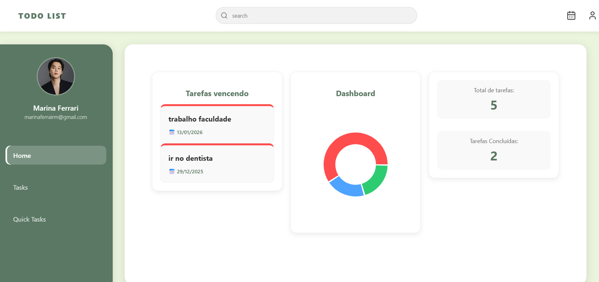
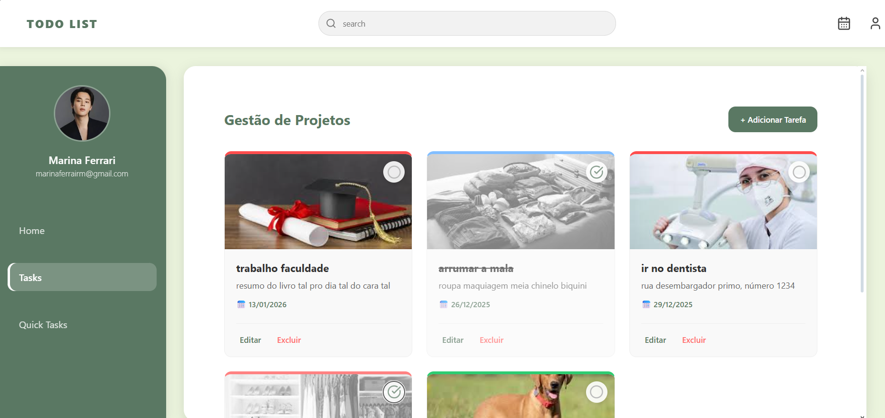
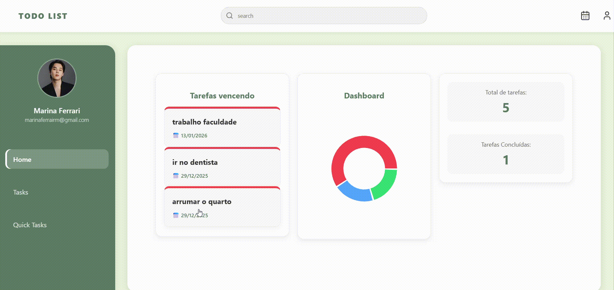

# 📝 TaskFlow Dashboard

O **TaskFlow** é um gerenciador de tarefas inteligente desenvolvido com React. O projeto foca em produtividade visual, oferecendo um dashboard interativo com gráficos de prioridade e um sistema de navegação inteligente entre a análise de dados e a gestão de tarefas.

---

## 📸 Screenshots

Aqui você pode ver a interface do projeto em funcionamento:

### 1. Visão Geral da Home


### 2. Gestão de Tarefas e Filtros


### 3. Navegação Inteligente (Deep Linking)


---

## 🚀 Funcionalidades Atuais

* **Dashboard Interativo:** Gráfico de rosca (Donut Chart) alimentado em tempo real, categorizando tarefas por prioridade (Baixa, Normal e Urgente).
* **Sistema de Alertas:** Identificação automática de tarefas de alta prioridade que ainda não foram concluídas.
* **Navegação com Scroll Inteligente:** Ao clicar em um alerta na Home, o usuário é levado à página de tarefas, e a tela realiza um scroll automático até a tarefa específica, aplicando um efeito visual de destaque.
* **CRUD Completo:** Criação, edição, exclusão e alteração de status (concluído/pendente).
* **Design Responsivo:** Layout em Grid e Flexbox que se adapta a diferentes resoluções.

---

## 🛠️ Tecnologias Utilizadas

* **React.js**: Biblioteca principal para construção da interface.
* **Recharts**: Biblioteca de gráficos para o dashboard.
* **Axios**: Cliente HTTP para comunicação com a API.
* **React Router Dom**: Gerenciamento de rotas e parâmetros de URL.
* **Lucide-React**: Pacote de ícones modernos.
* **JSON Server**: Simulação de API REST para persistência de dados local.

---

## 🏗️ Como Executar o Projeto

1. **Clone o repositório:**
  ```
  git clone https://github.com/marinawhale/react-node-crud-todo
  ```
   
2. **Instale as dependências:**
  ```
  npm install
  ```

3. **Inicie o Backend (JSON Server):**
  ```
  npx json-server --watch db.json --port 5000
  ```

4. **Inicie o Frontend:**
  ```
  npm start
  ```

---
  
🚧 O Caminho pela Frente (Roadmap)
Este projeto é um trabalho em progresso. Ele nasceu do desejo de estudar a integração entre visualização de dados e experiência do usuário (UX). Ainda há muito o que evoluir:

[ ] Persistência Real: Migrar do JSON Server para um banco de dados relacional (PostgreSQL/MySQL).

[ ] Autenticação: Criar sistema de login e perfis de usuário únicos.

[ ] Categorias Customizadas: Permitir que o usuário crie suas próprias tags de organização.

[ ] Dark Mode: Implementar um tema escuro nativo.

---

👨‍💻 Autoria
Este projeto faz parte do meu portfólio de estudos em Desenvolvimento Web. Sinta-se à vontade para entrar em contato, dar sugestões ou fazer um fork para contribuir!
